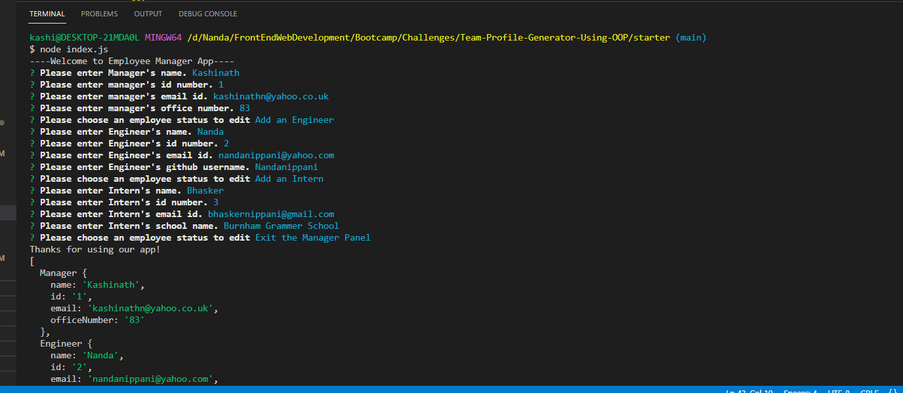

# Team-Profile-Generator-Using-OOP
## Description
This team-profile-generator app helps user to generate team profile using Inquirer for prompt.
This application allows user to enter information about manager, engineer and intern.
It includes information like employee-name, employee-id, employee-email for all employees.
Apart from this user can enter information like office number for manager and school name for intern

## Main Page
This page shows questions that are prompted to the user to generate this app.

These pages shows rendered html pages using page-template.js file

This page shows deployed application of team generator app

### The URL of the deployed application

### The URL of the GitHub repository that contains my code

https://github.com/Nandanippani/Team-Profile-Generator-Using-OOP

## Installation

N/A

## Usage

This project is used to demonstrate ability to use nodejs, object-oriented programming generationg classes and objects along with javascript

## Credits

N/A

## License

Please refer to the LICENSE in the repo.

